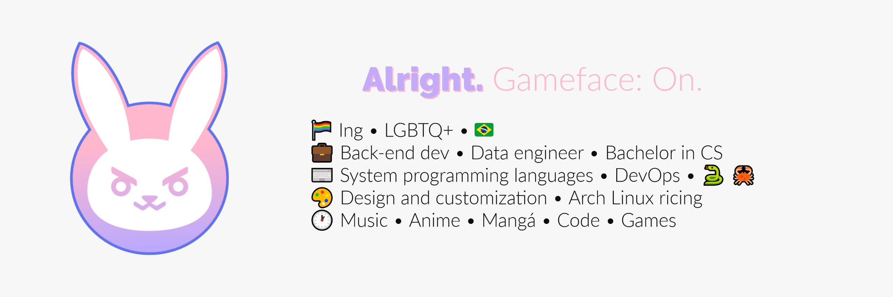



#  Hello hello
## I'm Anuj, a tech goblin and magical girl wannabe 

###  C++ & ROS2  Fast and dev  Platform Engineer
###  Python programming languages  GitHub  DevOps
###  Software architecture  Distributed systems  
###  Autonomous systems  Machine Learning  AI/ML
###  Robotics  Control systems  IoT & PKI

 

---

###  **What I do**

`cpp
while(alive) {
    code_robotics();
    build_autonomous_systems();  
    deploy_ml_models();
    drink_coffee();
}
`

###  **Current Quests**

---

###  **Tech Arsenal**

    

---

###  **Achievement Unlocked**

 **IIT Jodhpur** - Electrical Engineering Wizard  
 **Tata Motors** - Robotics Software Intern  
 **JEE Advanced 6479** - Among 2.5 lakh candidates  
 **Inter IIT Top 10** - UAV Fault-tolerant Control  
 **IEEE Published** - Swarm robotics research  

---

###  **Side Quests & Fun Projects**

-  **MIPS Simulator IDE** - Web-based processor simulator
-  **LinkedIn Scraper** - 500+ profiles/month extraction wizard
-  **HopNGo** - Unified ride booking across platforms  
-  **BLE Tracker** - AirTag-inspired tracking system
-  **Sketch Generator** - Sequential drawing AI model

---

###  **Let's Connect!**

---

<i>"In robotics, every bug is a feature waiting to be discovered in the real world" </i>

